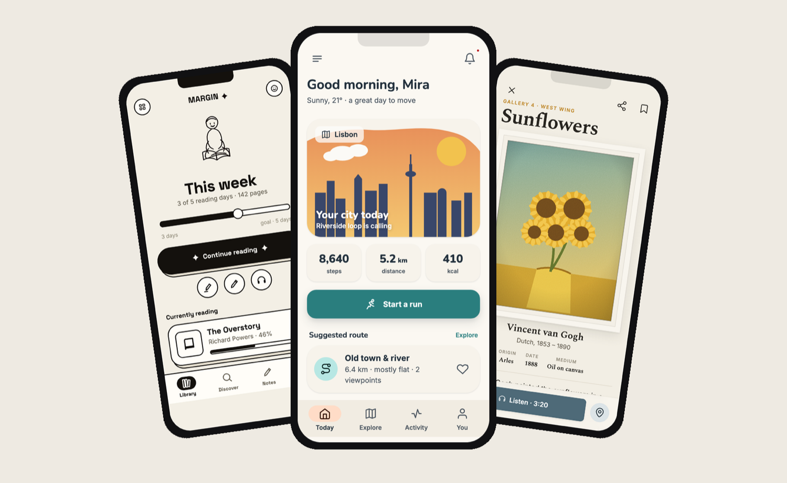
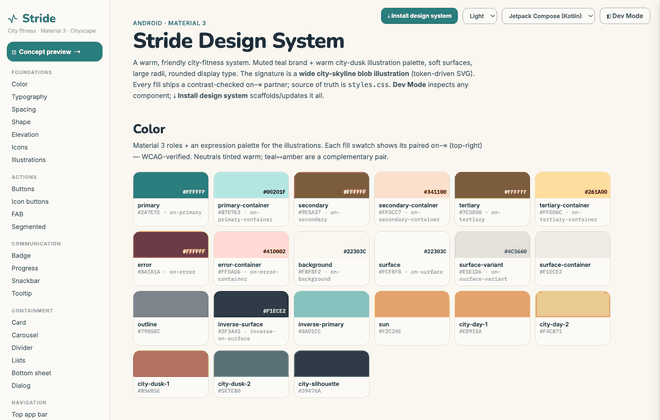
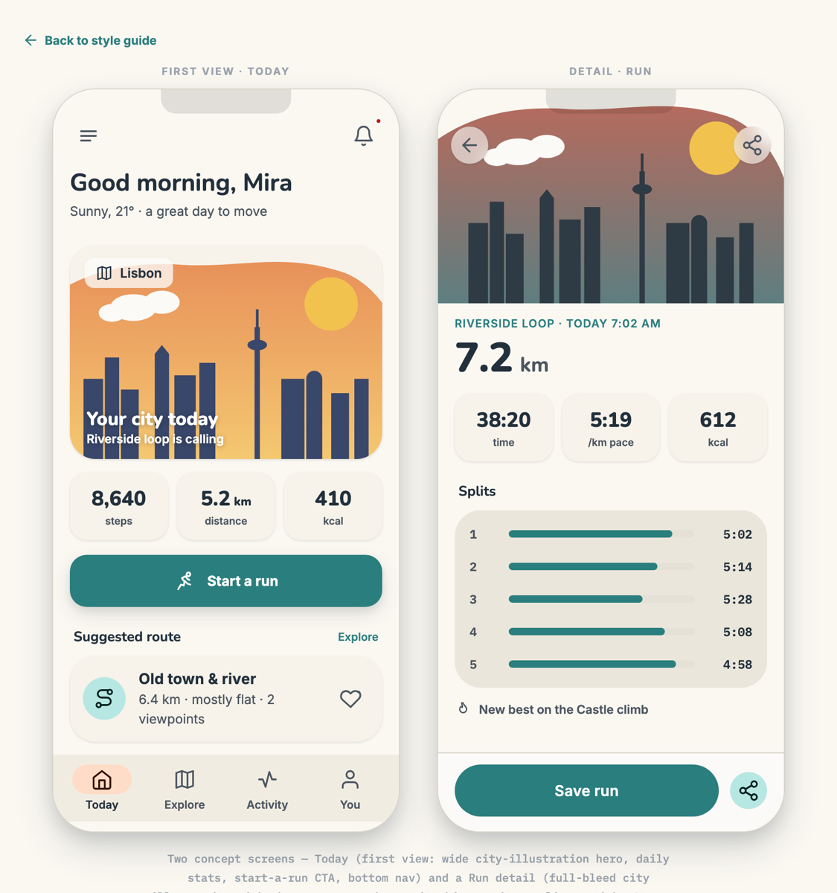

<div align="center">

# Mobile Design System

### A design system your AI can read and your team can *see*.

The output is **lightweight HTML — a shared protocol between you and the AI.** More glanceable than
markdown, far lighter than learning a design tool. Built for small teams and solo devs who want to ship.



<sub><b>Stride</b> · city fitness &nbsp;|&nbsp; <b>Margin</b> · reading &amp; notes &nbsp;|&nbsp; <b>Atrium</b> · museum — three apps, <b>one skill</b>; the look is just a token layer. Browse them in <a href="examples/">examples/</a>.</sub>

</div>

---

## Stop relaying artifacts. Start sharing a protocol.

The usual design-to-build loop is a chain of lossy translations:

> **human → artifact → human → artifact → …** &nbsp;(brief → mockup → spec → tickets → code → review…)

Every handoff loses intent and burns time. This skill replaces the chain with one shared, machine- and
human-readable layer:

> **human → protocol → AI → product**

That **protocol is the generated HTML** — a token layer + a complete, inspectable component catalogue.
You read it at a glance; the AI reads the same file to build, extend, and re-theme. No round-tripping
through a heavy design tool, no magic-number colors an agent can't reuse.

## Two reasons it's worth a try

**1. The output doubles as the interface.**
You get a self-contained `design-system/` (just `.html` + `.css`, opens via `file://`, no build). It's
glanceable like a webpage but structured like a spec: every value is a **named token**, every component
carries its props, the exact tokens it uses, and a one-click **"Copy as prompt"** so any agent can
implement it in Flutter / React Native / SwiftUI / Compose / Web. Switch the entire theme by rewriting
`:root` — the catalogue and concept re-render instantly.

**2. It already knows the components — you don't carve them off a canvas.**
Instead of you and the AI decomposing widgets from a blank artboard, it divides and designs **every
component by the canonical mobile guidelines** — Android → **Material 3**, iOS → **Apple HIG**,
cross-platform → **Material + MUI**. You start from a complete, correctly-named catalogue (buttons, FABs,
chips, sheets, nav, pickers, fields…), with all variants and states — not from scratch.

---

## The living style guide

Foundations + the full component catalogue in one scrollable page — with a Figma-style inspector built in.

<div align="center">

</div>

- 🔍 **Dev Mode** — click any component to inspect its props, the exact **tokens** it uses (click to copy), metrics, and source.
- 📋 **Copy as prompt** — per-component button → a self-contained implementation prompt for your framework (*add-or-update*: modify an existing component in place, or create it).
- ⤓ **Install design system** — one prompt that scaffolds (or updates) the **whole** system: tokens first, then every component against the shared layer.
- 🎨 **Theme switcher** — preview light / dark / alternate tones live; everything re-renders from the token layer.

…plus a **two-screen concept** (a *first view* + a *detail*, drawn from your app) so you can judge a direction at a glance:

<div align="center">

</div>

---

## Install

**Just tell your AI:**

> **Add the Claude Code plugin marketplace `rikucherry1993/mobile-design-system-skill` and install the `mobile-design-system` plugin.**

**Or run it yourself:**

```text
/plugin marketplace add rikucherry1993/mobile-design-system-skill
/plugin install mobile-design-system@mobile-design-system
```

<details>
<summary>Use it as a plain skill (no plugin)</summary>

```bash
git clone https://github.com/rikucherry1993/mobile-design-system-skill.git
ln -s "$(pwd)/mobile-design-system-skill/skills/mobile-design-system" ~/.claude/skills/mobile-design-system
```
</details>

## Use it

Tell it **what the app is**, the **target platform**, and a theme brief — in words and/or visuals
(screenshots, brand colors, reference URLs). It asks for anything missing, generates the system, **opens
it in your browser**, and walks you through keep / tweak / switch until you settle.

> "New recipe app for Android. Warm, friendly, rounded, orange accent. Target: Flutter."

> "iOS fitness app — minimal, high-contrast, dark-first. Match the vibe of this screenshot." *(attach an image)*

> "Cross-platform museum app. Editorial, art-forward. Use real artwork imagery."

A built-in **style & color library** (perceptual color systems + named design archetypes) grounds palette
and type choices when your brief isn't pinned to exact colors.

> **Greenfield only.** It does not migrate an existing design, reverse-engineer an app, or lay out
> multi-screen flows. Its job is **tokens + a complete component catalogue**, plus a two-screen concept.

## Repository

| Path | Purpose |
|---|---|
| [`skills/mobile-design-system/`](skills/mobile-design-system/) | **The skill** — `SKILL.md` + on-demand `references/` (design principles, architecture, the **component checklist**, build guide, **style & color library**) + `templates/` it fills in. |
| [`.claude-plugin/`](.claude-plugin/) | Plugin + marketplace manifests, so it installs via `/plugin marketplace add`. |
| [`examples/`](examples/) | The three real generated systems above. |
| [`CHANGELOG.md`](CHANGELOG.md) | Version history (SemVer). |

MIT — see [`LICENSE`](LICENSE).
